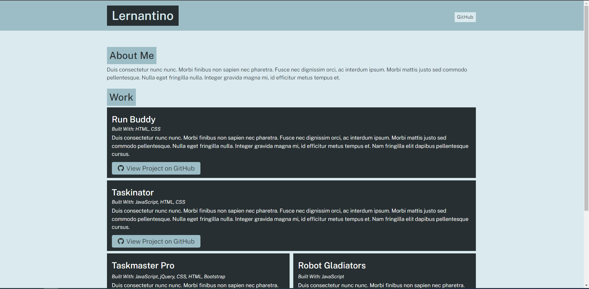

# portfolio-generator

- Github URL: https://github.com/DanielCConlon/portfolio-generator

## Table-of-Contents

- [Description](#description)
- [Usage](#usage)
- [Application](#application)

## [Description](#description)

Portfolio generator uses NOde.js and inquirer to build a HTML portfolio page. This app was created following the steps of a course module. An example of a generated portfolio is in the dist folder index.html file.

## [Usage](#table-of-contents)

- Clone the Repo
- Run `npm i` to get all of the packages
- Run `node app.js` to start the application
- Follow all of the prompts, your generated file will be in the dist folder.

## [Application](#table-of-contents)

